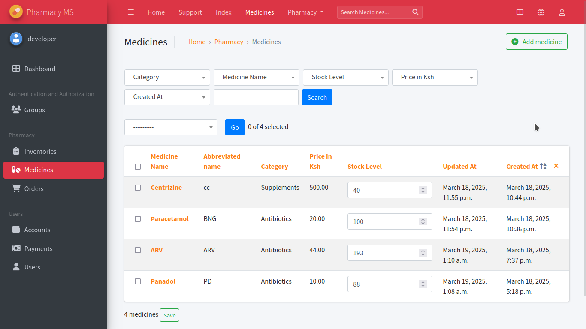

<h1 align="center">
pharmacy-management-system 
</h1>

<p align="center">
<a href="LICENSE"></a>
<a href="https://github.com/Simatwa/pharmacy-management-system/releases"></img></a>
<a href="https://github.com/Simatwa/pharmacy-management-system/releases"></img></a>
<a href="https://github.com/psf/black"></a>
<a href="https://hits.seeyoufarm.com"></a>
<a href="https://wakatime.com/badge/github/Simatwa/pharmacy-management-system"></a>

</p>

A web application for seamless medical prescription processing, order management, and customer communication.

## Screenshots

| Page Name  | Screenshot |
|------------|------------|
| Index      |  |
| Admin      |  |

## Features

- **Admin Dashboard**: Manage inventory, orders, and payments effortlessly.
- **User Authentication**: Customers can create accounts and log in securely.
- **Medicine Search & Listing**: Easy browsing and searching of available medicines.
- **Cart Management**: Add, update and remove items from the shopping cart.
- **Order & Checkout System**: Seamless checkout process with status tracking.

## Technologies Used

- **Backend**: Django, FastAPI
- **Frontend**: React.js

---

## Installation & Usage

### Prerequisites

Ensure the following dependencies are installed:

- [Git](https://git-scm.com/)
- [Python >= 3.13](https://www.python.org/downloads/)

### Installation

Clone the repository:

```sh
git clone https://github.com/Simatwa/pharmacy-management-system.git
cd pharmacy-management-system
```

Create and activate a virtual environment:

```sh
virtualenv venv
source venv/bin/activate  # For macOS/Linux
venv\Scripts\activate  # For Windows
```

Install dependencies:

```sh
pip install -r requirements.txt
```

### Database & Static Files Setup

```sh
python manage.py makemigrations users pharmacy
python manage.py migrate
python manage.py collectstatic
```

### Create Superuser

```sh
python manage.py createsuperuser --username developer \  
    --email developer@localhost.domain --noinput
```

#### Default Admin Credentials

| Username  | Password    |
|-----------|------------|
| developer | development |

> [!NOTE]
> - Admin panel: `/d/admin`.
> - API documentation: `/api/docs`.
> - API Redoc UI: `/api/redoc`.

### Running the Server

Start the backend server:

```sh
python -m fastapi run api
```

The application will be available at [http://localhost:8000](http://localhost:8000).

> [!TIP]
> If using the frontend, build it separately from [frontend](frontend) and rename the output `dist` to `dist.ready`.

## License

This project is licensed under the [MIT License](LICENSE).

